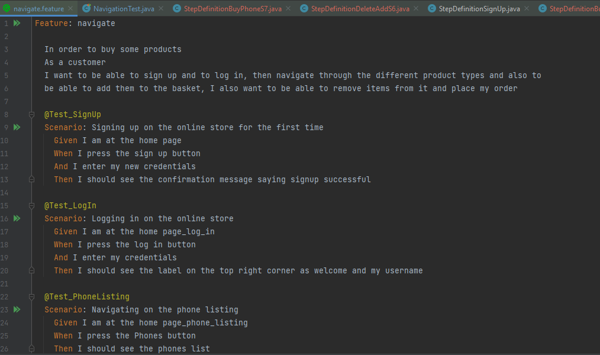
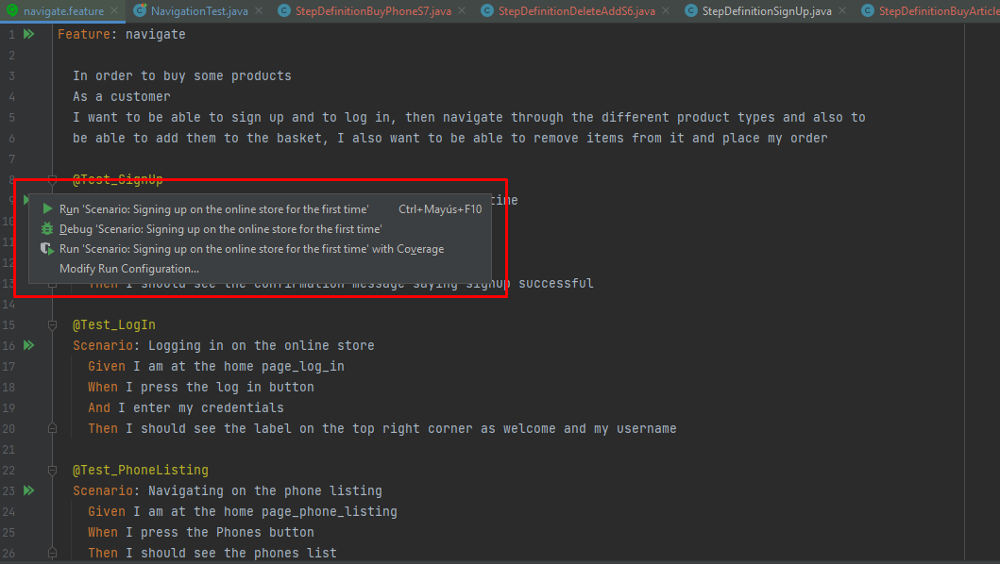
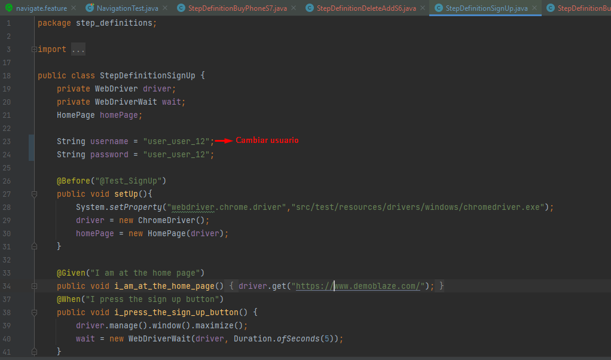

##Grupo4_m3_actfinal
###Sergio Guzman
###Jeisson Torrecilla

##Modo de uso

La finalidad del codigo es realizar testing a la pagina www.demoblaze.com como objketivo definido en la actividad del modulo 3. Las purebas estan orientadas en un entorno de **Windows**.

Notas:

1. Para ejecutar un solo test es posible hacerlo desde el archivo navigate.feature dando click en run para la prueba en especifico como se muestra en la siguiente imagen:

**Ruta:** src/test/resources/features/navigate.features

2. Para ejecutar las pruebas simultaneas ingresar a NavigationTest y ejecutar la Public Class NavigationTest.

**Ruta:** src/test/java/starter/NavigationTest

3. Para ejecutar correctamente el test de StepDefinitionSignUp se debe validar que el usuario a crear no exista, d elo contrario debe cambiarse manualmente como se muestra a continuación:

**Ruta:** src/test/java/step_definitions/StepDefinitionSignUp

4. Enjoy the test :)

